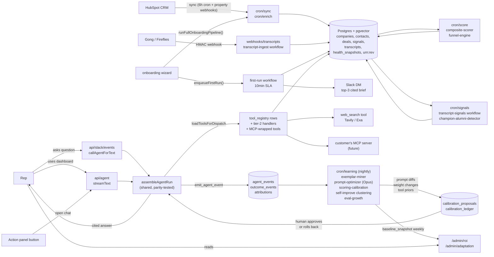

# OS as integration layer

> **Status:** Active product spec
> **Audience:** Founder, prospects, integration partners, CTO/architect buyers
> **Last updated:** April 2026
> **Reads with:** [`08-vision-and-personas.md`](08-vision-and-personas.md), [`10-data-flywheel.md`](10-data-flywheel.md), [`07-ai-agent-system.md`](07-ai-agent-system.md), [`MISSION.md`](../../MISSION.md)

---

## 1. Why an "OS" rather than another AI tool

Most "AI for sales" products are tools — they sit *beside* the workflow.
Revenue AI OS sits *under* it. Three architectural commitments make this
a literal claim, not a tagline:

1. **Connectors and tools are rows, not code.** Adding a new integration
   (HubSpot custom property, Slack channel, internal MCP server, REST
   API) is a `connector_registry` insert and a Tier-2-disciplined
   handler — never a re-deploy of the agent runtime.
2. **One ontology, many surfaces.** The same `companies`, `contacts`,
   `opportunities`, `signals`, `transcripts`, `health_snapshots` tables
   power the dashboard, the Slack DM, the Action Panel, the pre-call
   brief, and the weekly digest. Every claim in every surface cites its
   `urn:rev:` URN.
3. **The OS owns the events; the customer owns the data.** CRM stays
   the source of truth. We sync in, score, run the agent, and write
   back via APIs. Cancelling the OS leaves your HubSpot exactly as it
   was, plus an event log you can export.

The "OS test" any new capability has to pass:

> **Does it work for net-new tenants without writing per-tenant code?**

If yes, it's an OS feature. If no, it's a custom integration that should
go through the connector registry instead.

---

## 2. Integration-flexibility matrix

What plugs in today, what's near-term, what's out of scope.

| Integration | Read (sync in) | Write (push out) | Webhook | Agent-callable tool | Telemetry sink | Status |
|---|---|---|---|---|---|---|
| **HubSpot CRM** | Yes — companies, deals, contacts, activities, owners (6h cron + property webhooks) | Yes — `updateAccountScores` writes priority_tier + propensity to a configurable property; activity log via `log_crm_activity` | Yes — property changes < 30s lag (apps/web/src/lib/onboarding/hubspot-webhooks.ts) | Yes — full CRUD via `update_crm_property`, `create_crm_task`, `log_crm_activity` | Yes — `outcome_events` recorded on deal stage changes | Shipped |
| **Salesforce CRM** | Yes — same shape via SalesforceAdapter | Yes — score write-back, signal record creation | Limited — pull-only today; webhooks Q3 | Yes — same tool surface as HubSpot | Yes | Shipped |
| **Slack** | Yes — DM threads, button actions, signing-secret verified | Yes — proactive DMs (cooldown + push budget), digest posts, action button responses | Yes — `/api/slack/events` consumes message + block_actions | Indirect — the agent runtime IS the Slack handler | Yes — every Slack interaction is an `agent_event` | Shipped |
| **Gong transcripts** | Yes — webhook ingest with HMAC verification | No (read-only) | Yes — `/api/webhooks/transcripts` | Yes — `search_transcripts`, `extract_meddpicc_gaps` | Yes — transcripts feed the signal mining workflow | Shipped |
| **Fireflies transcripts** | Yes — same shape | No | Yes | Yes | Yes | Shipped |
| **Apollo enrichment** | Yes — firmographic + job posting + intent | No | Yes (job postings refresh) | Yes — `research_account` + signal cron | Yes | Shipped |
| **Web search (Tavily / Exa / Brave)** | Yes — provider-agnostic via `web_search` tool | No | No | Yes — `web_search` (apps/web/src/lib/agent/tools/handlers/web-search.ts) | Yes — every result attaches `source_url` for citations | Shipped (Tavily default) |
| **Inbound MCP server (customer's internal)** | Yes — register as `connector_registry` row, expose tools | Depends on the MCP | Depends | Yes — auto-wrapped in Tier-2 harness | Yes | Q3 (see §4) |
| **Outbound MCP (OS exposed as MCP server)** | n/a | n/a | n/a | n/a | Yes | Q3 (see §4) |
| **Internal REST / GraphQL** | Yes — register a connector + handler | Yes via tool | Optional via webhook adapter | Yes | Yes | Per-customer (Scale tier) |
| **Native webhook (custom event source)** | Yes — `/api/webhooks/[source]` route pattern with HMAC | n/a | Yes | n/a | Yes — payload lands in `outcome_events` | Per-customer |

The next 3 we'll add (in priority order, based on pilot demand):

1. **MS Teams** (mirrors the Slack adapter; same `runAgent` underneath).
2. **Zendesk / Intercom** (CSM-side: support-ticket signals → `churn_risk`
   pipeline, plays into the data flywheel).
3. **LinkedIn Sales Navigator** (champion-alumni detection currently
   uses email + name match; LinkedIn's job-change feed makes this
   real-time).

---

## 3. The end-to-end flow, visualised

The diagram every prospect asks for. From CRM connect to first cited
answer in the rep's Slack — all surfaces, all loops, with concrete
function names.



Each arrow corresponds to actual code. Anyone can follow them in 30
minutes:

- `cron/sync` → [apps/web/src/app/api/cron/sync/route.ts](../../apps/web/src/app/api/cron/sync/route.ts)
- `transcript-ingest workflow` → [apps/web/src/lib/workflows/transcript-ingest.ts](../../apps/web/src/lib/workflows/transcript-ingest.ts)
- `first-run workflow` → [apps/web/src/lib/workflows/first-run.ts](../../apps/web/src/lib/workflows/first-run.ts)
- `assembleAgentRun` → [apps/web/src/lib/agent/run-agent.ts](../../apps/web/src/lib/agent/run-agent.ts)
- `tool_registry` loader → [apps/web/src/lib/agent/tool-loader.ts](../../apps/web/src/lib/agent/tool-loader.ts)
- `web_search` → [apps/web/src/lib/agent/tools/handlers/web-search.ts](../../apps/web/src/lib/agent/tools/handlers/web-search.ts)
- `cron/learning` → [apps/web/src/app/api/cron/learning/route.ts](../../apps/web/src/app/api/cron/learning/route.ts)
- `prompt-optimizer` → [apps/web/src/lib/workflows/prompt-optimizer.ts](../../apps/web/src/lib/workflows/prompt-optimizer.ts)
- `calibration rollback` → [apps/web/src/app/api/admin/calibration/[id]/rollback/route.ts](../../apps/web/src/app/api/admin/calibration/[id]/rollback/route.ts)
- `/admin/adaptation` → [apps/web/src/app/(dashboard)/admin/adaptation/page.tsx](../../apps/web/src/app/(dashboard)/admin/adaptation/page.tsx)

This is the architecture-as-code property: a buyer's CTO can verify
every promise without trusting our slide deck.

---

## 4. The MCP roadmap (inbound + outbound)

Model Context Protocol matters because most B2B buyers are about to ship
their own internal MCP servers (pricing rules, product catalog,
compliance check, custom CRM views). The OS becomes 10x more useful when
those servers can plug in without code.

### 4.1 Inbound MCP — register external MCP servers as agent tools

**The promise:** A customer's internal MCP server (e.g.
`pricing-rules.acme.internal:3000`) registers as a `connector_registry`
row. Within 30 minutes of registration, every tool that server exposes
shows up as an agent-callable tool — wrapped in the Tier-2 harness so
each call returns `{ data, citations }`, retries are classified, and
telemetry is emitted.

**Mechanics:**

```
POST /api/admin/connectors/mcp
{
  "name": "Acme Pricing Rules",
  "endpoint": "https://pricing-rules.acme.internal/mcp",
  "auth": { "type": "bearer", "secret_ref": "MCP_PRICING_TOKEN" },
  "tools_to_expose": ["lookup_price", "check_discount_eligibility"]
}
```

The OS introspects the MCP server, generates a Zod schema per tool from
the MCP descriptor, and writes a row per tool into `tool_registry` with
`execution_config: { handler: 'mcp', endpoint, tool_name }`. The tool
loader resolves these via a generic `mcpToolHandler` that wraps the MCP
JSON-RPC call in the Tier-2 contract.

**Why this matters for the buyer:**
- A pricing question in Slack ("can I offer 12% on the Globex deal")
  becomes a multi-tool workflow without any code: agent calls
  `lookup_price` (customer's MCP) → calls `check_discount_eligibility`
  (customer's MCP) → cites both responses → drafts the email referencing
  the pricing constraint.
- The customer's internal team owns the tool semantics. We own the
  agent that calls them. No vendor change-request loop.

### 4.2 Outbound MCP — Revenue AI OS as an MCP server

**The promise:** Cursor, Claude Desktop, your own internal agent, or a
customer's automation pipeline can talk to the OS as an MCP server.
Tools exposed:

- `query_priority_accounts(rep_id)` — top-N by composite score
- `summarise_account(company_id)` — same as the dashboard tool
- `extract_meddpicc_gaps(company_id)` — same as the agent tool
- `propose_outreach(company_id, signal_id)` — same as the agent tool
- `record_outcome(subject_urn, event_type, value_amount)` — write back
- `subscribe_signals(company_id, types)` — async signal stream

Auth via per-tenant rotating tokens issued from `/admin/connectors/mcp`.

**Why this matters for the buyer:**
- Customer's RevOps team can build an internal Looker dashboard that
  pulls account-prioritisation data from us via MCP without scraping the
  UI.
- A customer's automation (n8n, Zapier, Pipedream, internal cron)
  can post outcome events to us so the attribution loop captures them
  too.
- Cursor / Claude Desktop users can ask "summarise the Acme deal"
  and get the same cited response a rep would see in the dashboard.

### 4.3 Phasing

| Phase | Scope | Status |
|---|---|---|
| **MCP-1 (Inbound, single tool)** | Wire one customer's MCP server, generate one tool, ship to one pilot. Validates the introspection + Tier-2-wrapping pattern. | Q3 (after v1 GA) |
| **MCP-2 (Inbound, multi-tool registry-driven)** | Multiple MCP servers per tenant, automatic schema regeneration on `connector_registry` change, RLS-scoped credentials. | Q4 |
| **MCP-3 (Outbound, public OS-as-MCP)** | OS publishes its own tools as an MCP server. Read-only first, write-enabled (record_outcome) second. | Q1 next year |
| **MCP-4 (Bidirectional + sub-agent calls)** | Agent can call sub-agents that each call MCP servers. Powers customer-built composed workflows. | TBD on demand |

---

## 5. The reproducible test flow (Day 1)

The canonical "does it work" demo path. Anyone — internal SE, a pilot
buyer's dev team, our own CI — can run this end-to-end and verify every
step against the event log.

### 5.1 The script

```bash
# Pre-reqs: Supabase env, Anthropic / Tavily keys (or run in mock mode).
npm run setup                         # creates a sandbox tenant
npx tsx scripts/e2e-first-run.ts      # the test flow itself
```

The script (to be added at `scripts/e2e-first-run.ts`) runs:

1. **Seed sandbox tenant.** Inserts a `tenants` row, a `business_profiles`
   row, a `rep_profiles` row with a fake Slack ID, and seeds the tool
   registry via `seedBuiltinTools()`.
2. **Mock CRM connect.** Loads a fixture set of 25 companies + 15 deals
   + 50 contacts into the ontology (mimics what `cron/sync` would write
   on a real HubSpot connect).
3. **Trigger the first-run workflow.**
   `enqueueFirstRun(supabase, tenantId, { rep_id, source: 'manual' })`
   then `runFirstRun(supabase, runId)`. The workflow:
   - Picks top-3 by composite priority.
   - Builds cited briefs (signals + transcript themes).
   - Posts a Slack DM (or skips with `slack_bot_token_missing` if no
     token — that's a verifiable skip path, not an error).
   - Emits `first_run_completed` with `elapsed_ms`.
4. **Assert the SLA.** Read the `agent_events` row for
   `event_type='first_run_completed'`, assert `elapsed_ms <= 600_000`
   (10 min) and `accounts_briefed === 3`.
5. **Trigger a chat turn through the unified runtime.** Call
   `assembleAgentRun(...)` with a sample question, assert the response
   has `citation_count > 0` and the model id matches the budget-aware
   selection.
6. **Assert the learning loop is wired.** Insert a fake `feedback_given`
   event with `payload.value = 'positive'`, run the exemplar miner, read
   `business_profiles.exemplars`, assert the row landed.
7. **Print the report.** Exits 0 on full success, 1 with the failing
   assertion otherwise.

### 5.2 What this proves

| Promise | Verified by |
|---|---|
| First cited answer ≤ 10 min | Step 4 |
| Tool registry resolves per tenant | Step 1 + the agent run in Step 5 |
| Same runtime across surfaces | Slack and dashboard both call `assembleAgentRun` (parity test in CI) |
| Citations are real URNs | Step 5 + the citation pills in the response payload |
| Learning loop persists | Step 6 |
| Holdout cohort respected | Step 3 with the rep flagged as `control` skips Slack — assert `skip_reason === 'holdout_control'` |

### 5.3 What it does NOT cover (scope cuts)

- Real CRM webhooks (we mock instead — the webhook handlers have their
  own Vitest suites in `apps/web/src/lib/__tests__/hubspot-webhook.test.ts`).
- Real Slack DM delivery (we assert the dispatcher *would* call
  `chat.postMessage` with the right blocks; the Slack adapter has its
  own contract tests).
- Real Anthropic calls in CI (we use mock providers for the AI Gateway
  by default; tenants who pass real keys get a real cited brief).

---

## 6. Why this is a moat, not a feature

A competitor reading this doc could clone the dashboard in 6 weeks. They
cannot clone:

1. **Per-tenant compounding.** Per-tenant exemplars + prompt diffs +
   scoring weights + retrieval ranker means our agent gets *better* on
   your data the longer you use it. Theirs starts at zero every day.
   ([10-data-flywheel.md](10-data-flywheel.md) goes deeper.)
2. **The event log as audit chain.** Every claim, every adaptation,
   every dollar of influenced ARR has a row. A buyer who values
   defensibility (regulated industries, public companies, RevOps in
   $50M+ ARR companies) cannot ship a competitor whose intelligence is
   a black box.
3. **The OS shape.** Tool registry + connector registry + ontology means
   adding the next 10 capabilities is configuration. A monolithic
   competitor pays linearly per capability; we pay logarithmically.

The three-tier harness ([`MISSION.md`](../../MISSION.md) §"three-tier
harness doctrine") is the operating discipline that makes the OS shape
*safe* to extend. Without it, "configurable" becomes "unstable" within
a year.

---

## 7. Risks, called out

We are honest about what could go wrong with this plan.

| Risk | Mitigation |
|---|---|
| MCP standard evolves; today's spec breaks | We version the connector_registry rows; older versions keep working until the customer migrates. The MCP protocol is stable on JSON-RPC 2.0; surface changes only affect our schema generator. |
| Customer's internal MCP server has SLA worse than the OS | Per-tool retry classification + budget cap + a fallback "tool unavailable" handler. Tenants can disable individual MCP tools from `/admin/ontology` without disabling the connector. |
| Tool count grows past 50, agent picks the wrong tool | The Thompson-bandit ranker + the per-intent ranking already keep tool selection bounded. We cap effective tool surface per-turn at 12 (top-by-bandit + must-includes for the surface). |
| Holdout cohort interpretation drift | The is_control_cohort flag is set at write-time in attribution.ts and gated by a Vitest contract test (apps/web/src/lib/workflows/__tests__/attribution-holdout.test.ts). |
| Vendor lock-in via tool registry | Tools are exportable as JSON. Tenants who churn can take their tool definitions to a competitor; the value lives in the per-tenant compounding, not the tool list. |

---

## 8. What good looks like, 12 months in

The OS test (does it scale without per-tenant code?) holds up across:

- 50 tenants, each with their own scoring weights, prompt body, tool
  registry — zero per-tenant code paths in `apps/web`.
- 5 MCP-connected tenants, each with 3-10 internal tools exposed to the
  agent, each generating per-tenant attributions.
- An external developer ecosystem: 3rd parties write MCP-callable
  workflows that consume the OS's outbound MCP, registering as
  `connector_registry` rows on our side.
- The flywheel measurable (see [10-data-flywheel.md](10-data-flywheel.md)
  §"What good looks like"): per-tenant prompt diffs converging, eval
  suite size growing 5x, churn signals firing 2 weeks before the
  outcome event lands.

If those four things are true, the OS framing has paid off and the
buyer's choice between us and a tool stack is no longer close.
