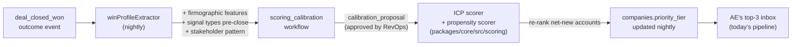
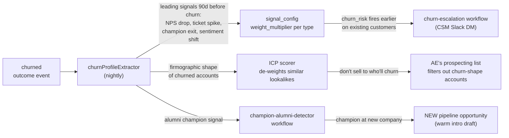
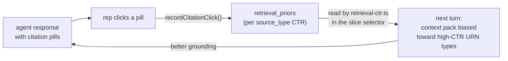

# The data flywheel — why pipeline + portfolio in one product compounds

> **Status:** Active product spec
> **Audience:** Founder, prospects, investor diligence, RevOps buyers
> **Last updated:** April 2026
> **Reads with:** [`08-vision-and-personas.md`](08-vision-and-personas.md), [`09-os-integration-layer.md`](09-os-integration-layer.md), [`MISSION.md`](../../MISSION.md)

---

## 1. The case for "both jobs in one product" (and why specialists can't replicate it)

The first instinct of a sceptical buyer is correct: most successful B2B
SaaS picks one persona and dominates it before expanding. So the
question deserves a sharper answer than "we do both."

The answer is not "we do both." The answer is:

> **Wins and churn are the same dataset, told from opposite ends of the
> deal lifecycle. Studying them together is the only way the OS gets
> measurably smarter at finding *more wins like the wins you already
> have* and *fewer customers like the ones who already left*.**

This is the data flywheel. It needs both halves of the deal lifecycle in
one ontology to close — and that is structurally hard for any
specialist to replicate, because:

- **Outreach knows your sequences but not your churn.** Every customer
  who churned in month 7 is invisible to Outreach's "send better
  emails" model. The OS sees both signals.
- **Gainsight knows your churn but not your prospecting.** Every
  champion job change is a churn risk in Gainsight; in the OS it's
  *also* a net-new pipeline signal at the champion's new company.
- **Gong knows what was said in calls but not whether the firmographic
  shape repeats.** Without an ICP scorer that ingests both win and
  churn profiles, transcript intelligence is local.
- **Clari knows the forecast roll-up but not the per-account causation.**
  Without per-deal attribution events, "we missed forecast by 12%"
  doesn't tell you which deals to coach.

The flywheel needs **the same URN namespace** to compose. That's why
both jobs live on one ontology, one agent, one event log.

---

## 2. The four sub-flywheels

Four loops compound on each other inside the OS. Each one is real code;
each one is measurable on `/admin/profiles` (new page, see §5).

### 2.1 Closed-won → ICP refinement → next pipeline



**Concrete mechanic:**

1. When a deal closes won, the `outcome_events.deal_closed_won` row
   triggers the win-profile extractor.
2. The extractor walks back 90 days on the URN namespace and pulls
   every signal, transcript theme, MEDDPICC field, and firmographic
   feature that landed before the close.
3. Those features feed `scoring_calibration` (apps/web/src/lib/workflows/scoring-calibration.ts)
   which proposes weight adjustments to the propensity scorer.
4. RevOps approves the proposal in `/admin/calibration` (with one-click
   rollback if it underperforms on holdout).
5. Tonight's score cron re-ranks every net-new account in the funnel
   using the updated weights. Tomorrow morning's top-3 in the AE's
   Slack DM reflects the lesson.

**Why the flywheel can't run on a tool:** the tool would need access
to your transcripts, your firmographic enrichment, your CRM stage
history, your closed-won outcomes, AND the agent prompt that draws on
them — under one tenant ID. None of the specialist tools cross all of
those boundaries.

### 2.2 Churn → upsell mirror loop

The same mechanic, run in reverse, on the customers who already churned.



**Concrete mechanic:**

1. When a customer churns, the churn-profile extractor identifies the
   leading signal types over the 90 days before churn. (NPS drop +
   support-ticket-spike + champion-exit is the canonical pattern.)
2. The signal `weight_multiplier` for those types ticks up — making
   the same signal pattern fire `churn_risk` earlier on every other
   customer in the portfolio.
3. The firmographic profile of the churned account de-weights similar
   lookalikes in the ICP scorer. We literally stop selling to companies
   that look like the ones who churn.
4. The champion who left becomes an alumni signal — they're now at a
   new company, which becomes a *net-new pipeline* opportunity.
   Champion-alumni-detector workflow ([apps/web/src/lib/workflows/champion-alumni-detector.ts](../../apps/web/src/lib/workflows/champion-alumni-detector.ts))
   fires the warm-intro draft via the `draft_alumni_intro` tool.

This is the moment the "two jobs in one product" claim becomes
defensible: the same data point (champion job change) is a *churn risk*
on the old account AND a *pipeline signal* on the new account. A
specialist tool sees only one half.

### 2.3 Citation clicks → retrieval ranker → better grounding

The "small flywheel" inside the agent runtime that compounds the answer
quality of every chat turn.



**Concrete mechanic:**

1. Every assistant message renders citation pills under the response
   ([apps/web/src/components/agent/citation-pills.tsx](../../apps/web/src/components/agent/citation-pills.tsx)).
2. Click events go to `recordCitationClick()` ([apps/web/src/app/actions/implicit-feedback.ts](../../apps/web/src/app/actions/implicit-feedback.ts))
   which writes to `retrieval_priors`.
3. The packer reads `retrieval_priors` via [apps/web/src/lib/agent/context/retrieval-ctr.ts](../../apps/web/src/lib/agent/context/retrieval-ctr.ts)
   and biases slice scoring toward URN types the rep actually clicks.
4. The next turn's context pack is materially better grounded for
   *this rep's preferences*.

Inside 30 days for an active rep, the retrieval CTR materially shifts
the ranker. Net effect: the agent stops surfacing `urn:rev:transcript:`
URNs to a rep who only ever clicks `urn:rev:signal:`, and vice versa.

### 2.4 Negative feedback → prompt diff → next week's prompt

The most consequential flywheel — and the one the strategic review
specifically called out as broken pre-Phase-1.

```mermaid
flowchart LR
    thumbsDown["thumbs-down<br/>feedback_given<br/>payload.value=negative"] --> miner["exemplar-miner<br/>(nightly, defence in depth)"]
    miner -->|"top-K negatives<br/>per (role, intent_class)"| optimizer["prompt-optimizer<br/>(weekly Opus call)"]
    optimizer -->|"PromptDiffSchema<br/>generateObject"| proposal["calibration_proposals<br/>config_type=prompt"]
    proposal -->|"RevOps approves<br/>at /admin/calibration"| ledger["calibration_ledger<br/>(applied)"]
    ledger -->|"business_skills.agent_personality<br/>updated"| nextWeekPrompt["next week's prompt body"]
    nextWeekPrompt -->|"reps see the new behaviour"| thumbsUp["thumbs-up rate ↑<br/>(measured on /admin/adaptation)"]
```



**Concrete mechanic:**

1. Reps thumbs-down responses they don't like.
2. The nightly exemplar miner ([apps/web/src/lib/workflows/exemplar-miner.ts](../../apps/web/src/lib/workflows/exemplar-miner.ts))
   collects negatives + cross-checks `agent_interaction_outcomes.feedback`
   so a thumbs-up correction overrides a stale thumbs-down.
3. The weekly prompt-optimizer ([apps/web/src/lib/workflows/prompt-optimizer.ts](../../apps/web/src/lib/workflows/prompt-optimizer.ts))
   reads the current `agent_personality` skill body, the negatives,
   and the positives — and calls Opus with a typed `PromptDiffSchema`
   to propose a surgical revision (≤5 changes, no rewrites).
4. Negative-lift proposals are auto-rejected by the optimizer itself
   (the schema includes `expected_lift`; values below 0 are dropped
   before the proposal even lands).
5. RevOps approves at `/admin/calibration`. The new prompt body
   updates `business_skills.agent_personality` and starts serving
   reps the next chat turn.
6. The thumbs-up rate trendline on `/admin/adaptation` shows whether
   the change worked. If it didn't, one-click rollback restores the
   prior version.

This is the literal "self-improving" claim. The strategic review
documented (in §3) that pre-Phase-1 every step except (1) was broken.
Phase 1 fixed every step.

---

## 3. Why "two-job tools" in CRMs aren't the same as the flywheel

Some buyers will say: "HubSpot has Service Hub for portfolio + Sales Hub
for pipeline; isn't that the same thing?"

It's not. Three structural differences:

1. **Different tenants of the same vendor's stack ≠ same ontology.**
   HubSpot's Sales and Service hubs share an account record but use
   different events, different scoring, different agents. The cross-
   product flow (champion in Sales transitions to a Service ticket
   contact, then job-changes) is not a first-class signal that re-ranks
   the AE's prospecting list.
2. **No per-tenant scoring calibration.** HubSpot Breeze AI is one
   model serving every customer. Your win profile is not a feature it
   learns. Our `scoring-calibration` workflow proposes per-tenant
   weight changes; HubSpot's score is the same for you and your
   competitor.
3. **No event log designed for attribution + holdout.** Service Hub
   tracks ticket events; Sales Hub tracks deal events; nothing joins
   them with a confidence score and a control-cohort flag. Our
   `attributions` table does that by construction.

The same critique applies to Salesforce + Service Cloud + Marketing
Cloud, just with more SKUs.

---

## 4. The five concrete artefacts the flywheel produces

If a buyer asks "what do I actually see," show them these.

| Artefact | Where it lives | What it shows | Refreshed |
|---|---|---|---|
| **Per-tenant ICP weights** | `tenants.scoring_config.propensity_weights` (writable via `/admin/calibration`) | The current weight per dimension. Auditable. Roll-back-able. | On every approved calibration_proposal |
| **Per-tenant signal weight multipliers** | `tenants.signal_config.signal_types[].weight_multiplier` | How much each signal type contributes to urgency. Different for staffing vs SaaS vs healthcare. | On every approved calibration_proposal |
| **Per-tenant prompt body** | `business_skills` rows with skill_type='agent_personality' | The exact text the agent uses today. Versioned, diffable. | On every approved prompt_optimizer proposal |
| **Per-tenant exemplars** | `business_profiles.exemplars` keyed by `(role, intent_class)` | The 3 best (q, a) pairs the agent has seen for this surface, injected as few-shot. | Nightly via exemplar-miner |
| **Per-tenant retrieval ranker priors** | `retrieval_priors` keyed by `(tenant, source_type)` | CTR per URN type. Biases the slice selector. | On every citation click |

These five are *the moat*. They don't transfer to a competitor. They
take ~6 weeks of real usage to converge into a noticeably-different
shape. After 6 months they're a different agent than a fresh tenant
gets — and that difference IS the value of the OS.

---

## 5. The shipped artefact for the customer — `/admin/profiles`

The `/admin/profiles` page (proposed v1 add, see Phase 2 backlog) makes
the flywheel tangible to the customer in two columns.

```
WIN PROFILE                          CHURN PROFILE
─────────────────                    ─────────────────
Industries we win in:                Industries we lose to churn:
  - Logistics (32%)                    - Early-stage SaaS (47%)
  - Healthcare (28%)                   - Pre-Series-A (29%)
  - Light Industrial (18%)             - Companies <50 employees (24%)

Top 5 win signals (90d):             Top 5 churn signals (90d):
  - hiring_surge (in 47% of wins)      - champion_exit (in 61% of churns)
  - leadership_change (38%)            - nps_dropped_below_5 (52%)
  - funding_event (24%)                - support_ticket_spike (44%)
  - peer_purchase (19%)                - sentiment_negative (38%)
  - existing_customer_referral (17%)   - inactive_30_days (33%)

Avg sales cycle (won deals):         Avg time-to-churn (lost customers):
  87 days                              211 days from contract start

→ Influencing your scoring weights:   → Influencing your scoring weights:
  - icp_scorer.industry: +12%          - icp_scorer.size_tier: -8% for <50
  - signal_scorer.hiring_surge: +18%   - signal_scorer.churn_risk: +22%
```

Each number links to a query in the event log. Each link copies as a
permalink the customer can paste into a Loom for their CFO.

This is the artefact that makes "the OS gets smarter on your data"
something the buyer can *show* to their CFO without our help.

---

## 6. What good looks like, 12 months in

The flywheel is real if these all hold:

| Metric | Pilot Day 0 | Pilot Day 90 | Pilot Day 365 |
|---|---|---|---|
| Per-tenant ICP weight diffs from cold-start defaults | 0 (cold-start) | 1-3 dimensions adjusted | 5-10 dimensions adjusted, monthly cadence |
| Per-tenant signal weight multipliers diffs | 0 | 1-2 types adjusted | 5+ types continuously tuned |
| Per-tenant prompt diffs accepted | 0 | ≥ 1 | ≥ 12 (one a month) |
| Eval suite size from production failures | 75 (seed) | 100 (+25 production) | 200+ (5x growth, per MISSION) |
| Retrieval-ranker CTR convergence | uniform | per-rep biases visible in priors table | per-(rep, intent_class) ranking distinct from defaults |
| Holdout-cohort treatment ARR uplift | n/a (not enough data) | bootstrap CI loose | bootstrap CI excludes 0 with p<0.05 |
| Win-profile distinct from cold-start template | n/a | starting to diverge | distinctly tenant-shaped, defensible to CFO |
| Churn-profile distinct from cold-start | n/a | first 1-2 patterns identified | full leading-signal profile, 2-week-earlier detection holding |

If even half of these hold at Day 365, the flywheel is the moat. If
none hold, the OS premise needs a different go-to-market — sell to a
narrower vertical, build deeper into one persona, or trade some
flexibility for opinionated defaults.

The Phase 1 work made every metric in this table *measurable*. The next
12 months are about whether they actually *move* — and the OS-level
discipline (per-tenant adaptation, holdout cohort, calibration
ledger, eval suite growth) is exactly what's required for those numbers
to be defensible against scrutiny when they do.

---

## 7. The risks of the flywheel claim, called out

| Risk | Mitigation |
|---|---|
| Cold-start period is too long; pilots churn before flywheel converges | First-run workflow (C1) delivers cited Slack DM in 10min. Initial value does not depend on flywheel maturity. Flywheel is the long-tail value. |
| Per-tenant data is too sparse for statistical learning | Cold-start defaults from MISSION-aligned vertical templates (staffing, SaaS, healthcare). Bayesian priors decay as tenant data accumulates — not a per-tenant cold start, more like "tenant fine-tunes a vertical baseline." |
| Customer perceives flywheel as black-box AI | Every adaptation lands in `calibration_ledger` with before/after values, approved by a human. Customer literally clicks through every change. |
| Bad calibration ships and degrades performance for a week | Rollback API + button (apps/web/src/app/api/admin/calibration/[id]/rollback/route.ts) restores `before_value` in one click. The 30-day age limit on rollback prevents stale rollbacks; for older changes, a fresh proposal is required (with current data). |
| Holdout cohort interpretation drifts | Read-time AND write-time enforcement (attribution.ts sets the flag at insert; `/admin/roi` filters on read). Vitest contract test in apps/web/src/lib/workflows/__tests__/attribution-holdout.test.ts gates CI. |
| Customer's data is too small for a flywheel to matter | Be honest about it. Tenants under 100 closed deals/year don't get the full ICP recalibration loop until they have the volume. We surface "X more closed deals required" on `/admin/calibration`. |

---

## 8. Where this fits in the doc tree

- **[`08-vision-and-personas.md`](08-vision-and-personas.md)** — the
  customer-facing pitch and persona pain points.
- **[`09-os-integration-layer.md`](09-os-integration-layer.md)** — the
  integration story and MCP roadmap.
- **`10-data-flywheel.md`** — *this doc* (the moat).
- **[`MISSION.md`](../../MISSION.md)** — the operating principles every
  flywheel mechanic respects.

If the flywheel claim is the headline of the next investor pitch, this
is the doc that backs it up — every loop maps to a workflow file, every
artefact maps to a database column, every metric maps to a
`/admin/adaptation` chart.
